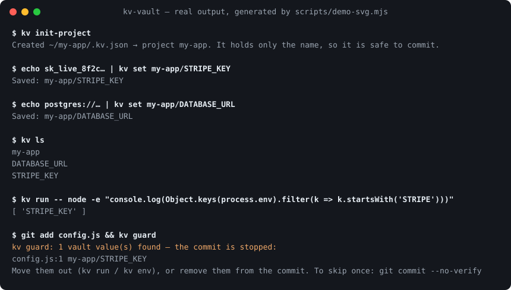
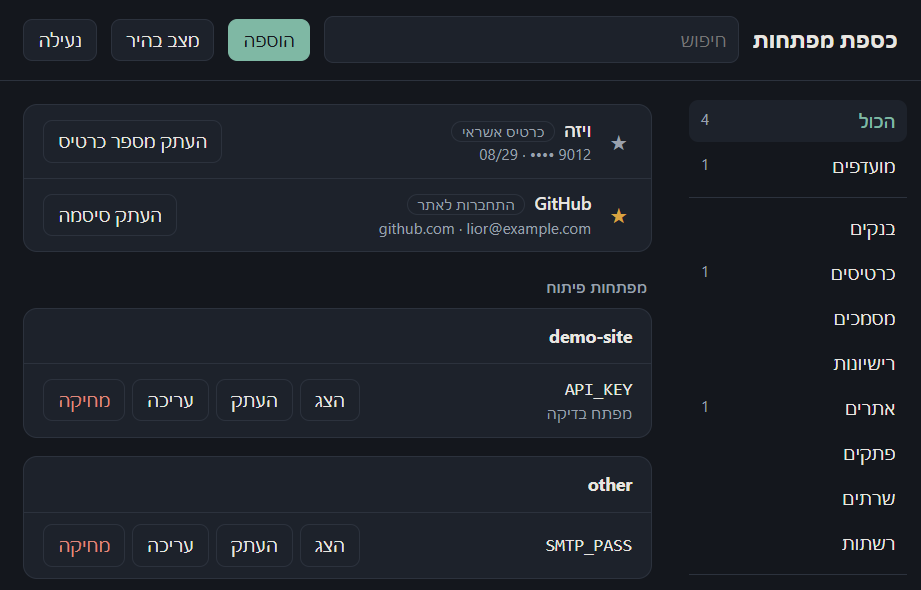

# kv-vault

[](https://github.com/liormedan/kv-vault/actions/workflows/ci.yml)
[](https://github.com/liormedan/kv-vault/releases/latest)
[](LICENSE)

A local, encrypted vault for a developer's API keys — one file, no account, no server.
`kv run -- npm run dev` injects a project's keys as environment variables, so there's no `.env` file to leak.
A `kv` command line for Windows, macOS and Linux, plus a Windows desktop app that also keeps logins, cards and notes.



<details><summary>The desktop app (Windows)</summary>



</details>

> The interface is in English by default, with Hebrew (right-to-left) one click away — the language button in the app, or `kv lang he` for the command line.

## Features

- **One encrypted file** — `~/.keyvault/vault.kv`. Argon2id key derivation and XChaCha20-Poly1305 encryption, both from [libsodium](https://doc.libsodium.org/). Project and key names are encrypted too.
- **Desktop app** (Tauri 2) — dark or light theme, categories, search, favorites, reveal / copy / edit / delete, auto-lock after 15 idle minutes.
- **Typed items** — login, credit card, bank account, identity document, Wi-Fi, server/SSH, software license, secure note — plus dev keys grouped by project.
- **Secrets stay hidden** — secret fields never appear in lists and reach the window only when you click reveal. Copy goes straight to the clipboard, is cleared after 20 seconds, and on Windows stays out of clipboard history and cloud sync. The vault locks when Windows locks.
- **Import from anywhere** — a browser's password CSV (Chrome, Edge, Firefox, Safari), or a password manager's export: 1Password (`.1pux` or CSV), Bitwarden (`.json`), KeePass (`.xml`), LastPass. Cards, notes and two-factor keys come along; duplicates are skipped, and the app offers to delete the plaintext export afterwards.
- **Password health** — reused, weak and year-old passwords, and logins without two-factor, in one view (`kv audit` on the command line). An opt-in breach check asks [Have I Been Pwned](https://haveibeenpwned.com/Passwords) with only the first 5 characters of each password's SHA-1 hash.
- **Two-factor codes** — paste a site's two-factor key (or `otpauth://` link) into a login and the app shows the current 6-digit code, ready to copy.
- **Browser extension** — Chrome, Edge and Firefox: fill the login for the site you're on, copy a two-factor code, save a sign-in you just submitted. It talks to this computer only (native messaging, no port, no account), only for the page's own site, and only once you turn it on in the app.
- **Sync without a server** — choose a folder your cloud already syncs (Drive, Dropbox, OneDrive, iCloud); kv-vault keeps an encrypted copy there and merges changes item by item. Edits on two computers at once keep both versions.
- **Share with one person** — seal an item or a dev key to someone's sharing key into a `.kvshare` file; only their vault can open it.
- **Emergency export** — an encrypted copy of the whole vault under its own password, or under a recovery code you print. If you forget the master password, `kv restore` turns it back into a vault.
- **Password generator** — 20 characters by default, randomness from libsodium.
- **CLI for dev keys** — pipe a key into another tool, or run a command with a project's keys as environment variables, without writing a `.env` file.
- **Remember me** — the derived key, not the password, goes to the system's own secret store: DPAPI on Windows, Keychain on macOS, Secret Service (GNOME Keyring / KWallet) on Linux.
- **Leak guard** — `kv guard` stops a commit that contains any value from the vault; `kv scan` finds the `.env` and key files scattered on disk.
- **Scriptable** — `--json` output, exit codes `0` ok · `1` failed · `2` wrong arguments, shell completion.

## Install

```bash
npm install -g kv-vault     # Node.js 22.6+ · Windows, macOS, Linux
kv init
```

Shell completion: `source <(kv completion bash)` (also `zsh`, `fish`, `powershell` — see `kv completion`).

**Desktop app (Windows):** the installer is attached to each [release](https://github.com/liormedan/kv-vault/releases/latest) (`kv-vault_x.y.z_x64-setup.exe`). It installs for the current user only and needs Node.js 22.6+.

Every release is built and published by GitHub Actions: the npm package carries [provenance](https://docs.npmjs.com/generating-provenance-statements) and the installer a build attestation, both linking back to the workflow run.

**From source:**

Requirements: [Node.js](https://nodejs.org/) 22.6 or newer; Rust and the [Tauri prerequisites](https://tauri.app/start/prerequisites/) for the desktop app. On Linux, `kv copy` needs `wl-clipboard` (Wayland) or `xclip` (X11).

```bash
git clone https://github.com/liormedan/kv-vault.git
cd kv-vault
npm install
npm link                 # installs the `kv` command
npm run app:installer    # builds the desktop installer (needs Rust + the Tauri prerequisites)
```

The installer is written to `app/src-tauri/target/release/bundle/nsis/`. It installs for the current user only (no admin rights) and adds Start menu and desktop shortcuts.

## In a project

```bash
cd my-app
kv init-project                    # writes .kv.json: {"project": "my-app"} — names only, commit it
kv set my-app/DATABASE_URL         # typed hidden, or piped in
kv set my-app/DATABASE_URL --env prod
kv run -- npm run dev              # the project comes from .kv.json; keys arrive as env vars
kv run --env prod -- npm start     # prod values where they exist, the default elsewhere
eval "$(kv env)"                   # or load them into the current shell (pwsh: kv env | iex)
kv example > .env.example          # names only, for the repo
kv check                           # which names in .env.example the vault is missing
```

## Keep keys out of git

Your vault knows your secrets, so it can see them before they're committed.

```bash
kv guard install                   # a pre-commit hook in this repository
git commit                         # stopped if a staged line contains any vault value:
                                   #   src/config.ts:12  my-app/API_KEY
kv guard --all                     # sweep every tracked file once
kv scan ~/code                     # every .env and key file on disk, and which values are already in the vault
kv scan ~/code --import            # move the ones that aren't into the vault, a project per folder
kv doctor                          # Node, permissions, backups, remember-me, .kv.json, the hook, stale keys
```

The hook reports file, line and key name — never the value. It needs "remember me" (a hook has no terminal for the password); without it the hook skips with a warning, or blocks with `kv guard --strict`.

## Ship to platforms

```bash
kv push vercel --env prod          # every key of the project → Vercel production (values via stdin, --sensitive optional)
kv push github --repo me/my-app    # → GitHub Actions secrets (or --environment prod)
kv diff vercel --env prod          # what's only here, only there, or different — names only; exit 1 if anything differs
kv pull vercel --env prod          # Vercel's values into the vault
```

kv drives the platforms' own CLIs (`vercel`, `gh`), so it uses the login you already have. Values only ever travel on their stdin. GitHub secrets can't be read back, so `kv diff github` compares names and there is no `kv pull github`.

## Command line

The full reference — every flag, exit code and `--json` shape — is in [docs/CLI.md](docs/CLI.md).

```bash
kv init                                   # create a vault (master password, no recovery if forgotten)
kv unlock --remember                      # remember on this Windows user, so commands don't ask
kv set my-app/API_KEY --note "prod key"   # value is typed hidden, or piped in
kv ls [project]                           # names only, never values
kv copy my-app/API_KEY                    # to the clipboard, cleared after 20 seconds
kv get my-app/API_KEY | vercel env add API_KEY production   # pipes only; refuses to print to a terminal
kv run [my-app] [--env prod] -- npm run dev   # keys as environment variables (project from .kv.json if omitted)
kv env [my-app] [--format sh|pwsh|fish|dotenv|json]   # values for eval or a pipe — refuses a terminal
kv init-project [name]                    # .kv.json in this folder
kv example | kv check                     # .env.example from the vault / what the vault is missing
kv mv my-app/OLD my-app/NEW               # rename a key (or kv mv old-project new-project)
kv import my-app .env.local               # import an existing env file (empty values are skipped)
kv import-passwords export.1pux --delete  # browser CSV, 1Password, Bitwarden, KeePass, LastPass; --delete removes the plaintext file
kv audit [--breaches] [--json]            # reused, weak and old passwords; --breaches asks Have I Been Pwned (hash prefixes only)
kv browser enable                         # connect the browser extension (off until enabled); status / disable
kv sync link ~/Dropbox/kv                 # sync through a folder you already sync; kv sync / status / off
kv share key                              # your sharing key (public) — give it to people who send you items
kv share my-app/API_KEY --to kvpk1.…      # seal a key (or --item <title>) for one person into a .kvshare file
kv receive API_KEY.kvshare                # add what someone shared with you
kv export rescue.kv --recovery-code       # encrypted emergency copy; prints a recovery code once (or asks for a password)
kv restore rescue.kv                      # a vault from an export, with a new master password
kv backup [dir]                           # dated encrypted copy (default: KV_BACKUP_DIR or ~/.keyvault/backups)
kv passwd                                 # change the master password
kv forget                                 # drop "remember me"
kv ui                                     # browser UI on 127.0.0.1 (if you don't use the desktop app)
kv lang <en|he>                           # interface language (also: KV_LANG)
kv status [--json]                        # version, vault path, remembered, language
kv ls --json                              # machine-readable: names and notes, never values
```

Data lives in `~/.keyvault/` (the project's original name — kept so existing vaults keep working).

Environment: `KV_LANG` — `en` or `he` (overrides `kv lang`). `KV_HOME` — vault folder (default `~/.keyvault`). `KV_BACKUP_DIR` — default backup folder. `KV_NO_OPEN=1` — `kv ui` doesn't open a browser.

## Security model

What it protects against: someone who gets the vault file (a backup, a synced folder, a stolen disk) without your master password.

- The vault file is safe to back up anywhere — without the master password it is ciphertext. Any change to it, including its header, fails decryption.
- The desktop app talks to its backend over a pipe — no port, no network. The browser UI (`kv ui`) listens on 127.0.0.1 only, with a random port and token, Host/Origin checks, and shuts down after 15 idle minutes.
- Values are never written to logs, error messages or command-line arguments.

Importing from a browser goes through the browser's own export file on purpose: kv-vault never reads a browser's password database directly.

The browser extension reaches the vault through a native messaging host the browser starts for it — the same process model as the desktop app, with no listening port. The host answers only the kv-vault extension's origin, only while "Browser extension" is on, and only with logins whose site matches the page (registrable domain; no https login on an http page). There is no call that lists the vault.

The breach check is the only feature that uses the network, and only when you ask: each password's SHA-1 is computed locally and only its first 5 hex characters are sent ([k-anonymity](https://haveibeenpwned.com/API/v3#SearchingPwnedPasswordsByRange)); the full hash is matched on your machine. Two-factor codes (HMAC-SHA1, RFC 6238) and that SHA-1 come from Node's `crypto` — they are protocol requirements libsodium doesn't offer; the vault's own encryption is libsodium only.

What it does **not** protect against: malware running as your user while the vault is unlocked, or anyone logged in as your Windows user when "remember me" is on. A forgotten master password can't be recovered — only an emergency export made beforehand gets you back in. Sync goes through a folder you already sync: what the cloud stores is the same ciphertext as the vault file. Shared items travel as libsodium sealed boxes to the recipient's public key; the sender is anonymous, so the app shows what a share file contains before adding it.

See [SECURITY.md](SECURITY.md) to report a vulnerability.

## Development

See [CONTRIBUTING.md](CONTRIBUTING.md), [docs/ARCHITECTURE.md](docs/ARCHITECTURE.md) and the vault [file format](docs/FORMAT.md) — enough to write your own reader.

```bash
npm run build         # esbuild: dist/cli.js, the bundled backend, app/ui/dist/
npm run typecheck     # tsc --noEmit
npm run lint          # Biome
npm run test:coverage # the suite with a coverage threshold (lines ≥ 75%)
npm test              # node:test suites against temporary vaults — never touches ~/.keyvault
npm run test:e2e      # the real desktop window on a temporary vault (local Windows, after app:build)
npm run app:build     # desktop app without the installer
```

Layout:

| Path | What |
|---|---|
| `src/crypto.ts` | libsodium only: Argon2id, XChaCha20-Poly1305 with the header as additional data, password generator |
| `src/store.ts` | vault file: atomic writes + `.bak`, dev keys and typed items |
| `src/types.ts` | item types — fields, which are secret, what quick-copy copies |
| `src/import-csv.ts` | password CSV import — columns matched by name |
| `src/backend.ts` | desktop backend: JSON lines over stdin/stdout |
| `src/cli.ts` | the `kv` command |
| `src/i18n.ts`, `app/ui/i18n.ts` | English and Hebrew strings — backend/CLI and the window |
| `src/dpapi.ts` | "remember me" via Windows DPAPI |
| `app/ui/` | the window (plain HTML/JS/CSS, strict CSP, no build step) |
| `app/src-tauri/` | the Tauri shell — starts the backend and relays requests; no crypto |

`npm run build` bundles the CLI (`dist/cli.js`, what `kv` runs), the backend (shipped inside the installer) and the window's scripts (`app/ui/dist/`).

## License

[MIT](LICENSE)
