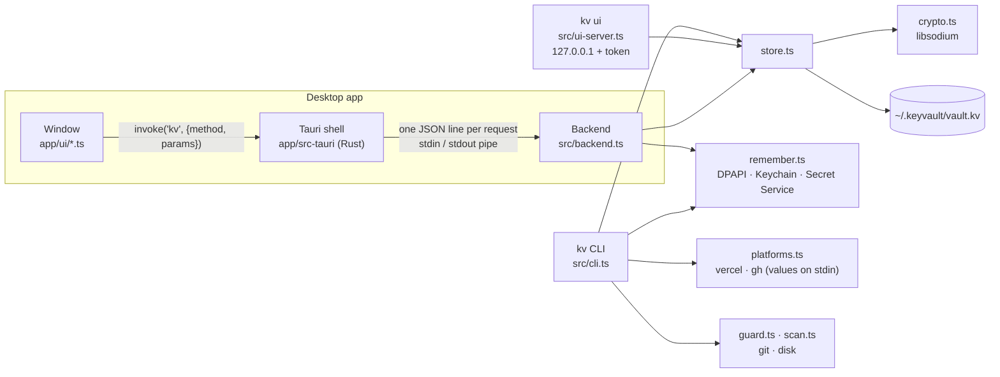

# Architecture

kv-vault is one encrypted file and three ways to reach it: the `kv` CLI, the desktop window, and the browser UI (`kv ui`). All three go through the same TypeScript modules in `src/`; only `src/crypto.ts` touches cryptography, and only libsodium primitives.

## The pieces

| Path | Role |
|---|---|
| `src/crypto.ts` | Argon2id key derivation, XChaCha20-Poly1305 with the header bound as additional data, the password generator. The only module that calls libsodium |
| `src/store.ts` | the vault file: atomic write (temp + rename) and a `.bak`, dev keys with per-environment values, typed items, listings without values |
| `src/model.ts` | the data model — types only |
| `src/protocol.ts` | the window ↔ backend contract. The backend's method table `satisfies Handlers`; the window calls through `kv<M>(method, params)`. A wrong method, parameter or result field fails to compile on either side |
| `src/backend.ts` | the desktop backend: a Node process behind a pipe — no port, no network. Auto-locks after 15 idle minutes, and the Rust shell locks it when Windows locks |
| `app/src-tauri/` | the Tauri shell: starts the bundled backend, relays requests, watches for the workstation lock. No crypto, no vault access |
| `app/ui/` | the window: TypeScript bundled by esbuild, strict CSP, English and Hebrew |
| `src/remember.ts` | "remember me": the derived key (never the password) in the OS secret store |
| `src/platforms.ts` | `kv push / pull / diff` through `vercel` and `gh`; every argument validated, values only on stdin |
| `src/guard.ts`, `src/scan.ts` | leak prevention: vault values vs. staged lines; `.env` and key files on disk, matched by hash |
| `src/i18n.ts`, `app/ui/i18n.ts` | English and Hebrew. Message keys are a type, and Hebrew must cover every English key |

## Rules the code keeps

1. **No custom cryptography.** libsodium only, in `crypto.ts`.
2. **Values never leave memory in the clear** except where the user asked for them: `kv get` / `kv env` into a pipe (both refuse a terminal), reveal in the window, the clipboard (cleared after 20 s, private on Windows), and the stdin of a platform CLI. Never in arguments, logs, error messages, listings or JSON output.
3. **The file format only grows.** New fields inside the encrypted payload are additive and normalized on open; a breaking change needs a new `v` and a migration. `test/fixtures/vault-pre-ts.kv` (written by 0.1) must keep opening.
4. **Every user-facing string goes through i18n**, in both languages.

## Threat model

Protects against: someone who gets the vault file — a backup, a synced folder, a stolen disk — without the master password. Any change to the file, header included, fails decryption.

Does not protect against: malware running as your user while the vault is unlocked; anyone logged in as your user while "remember me" is on; a compromised Node.js or OS. See [SECURITY.md](../SECURITY.md) to report a vulnerability, and [FORMAT.md](FORMAT.md) for the file format.

## Tests

- `npm test` — `node:test` suites against temporary vaults (never `~/.keyvault`), on Windows, macOS and Linux in CI. The real clipboard test runs in CI only (Windows, macOS), the Keychain round-trip on macOS.
- `npm run test:e2e` — the real desktop window, driven over WebView2's DevTools protocol (Windows, local).
- `*.typecheck.ts` — compile-time checks that bad calls don't compile.
